**Alice Property Snapshot Tool** is a convenient tool for temporarily storing and transferring object properties in the Unreal Engine editor.

It can read and temporarily store editable properties from most commonly used objects in the Unreal Engine editor, and when needed, transfer them to properties with the same name or user-specified properties of the same type on other objects.

[Video Tutorial](https://www.youtube.com/watch?v=OR-5Xs4HncA)

[Marketplace Link](https://www.unrealengine.com/marketplace/en-US/product/53d44cf2e0a540c89345657e479030bf)

# Quick Start

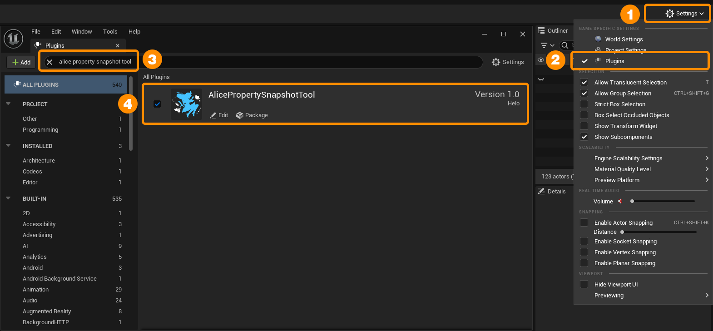

Go to ① **Setting** -> ② **Plugins**, search for ③ "Alice Property Snapshot Tool," ④ check the box and restart the engine editor to enable the plugin.

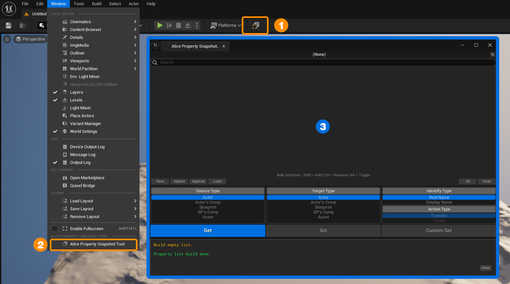

① Click the tool button on the **Toolbar**, or open the ③ tool panel from ② **Window** -> **Alice Property Snapshot Tool** in the menu.

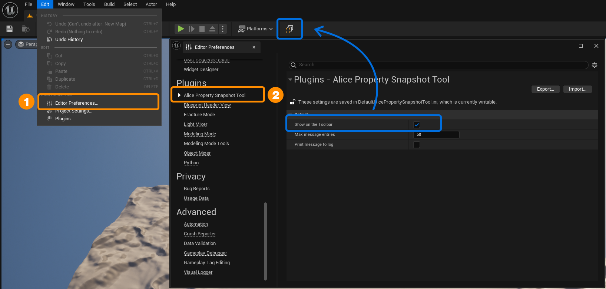

If you don’t want the Toolbar button to be displayed, you can disable it through the tool settings. Go to ① **Edit** -> **Editor Preferences**, and under the "Plugins" category, find the ② **Alice Property Snapshot Tool** plugin settings. Uncheck ③ "Show on the Toolbar" to remove the tool button.

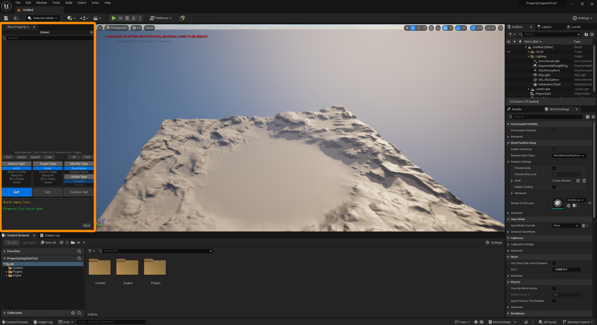

You can drag the tool panel and dock it in any suitable position.

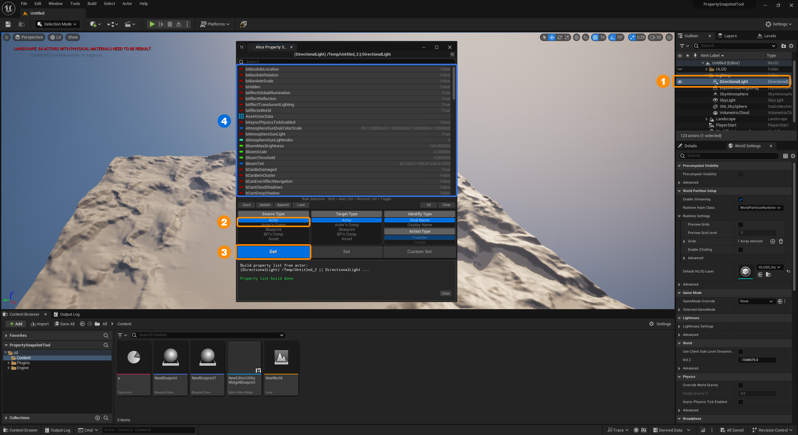

Select any ① **Actor** in the scene and set ② **"Source Type"** to **"Actor"** to indicate that the source type you want to capture is an Actor. Click the ③ **[Get]** button to retrieve the properties of the selected Actor from the details panel.

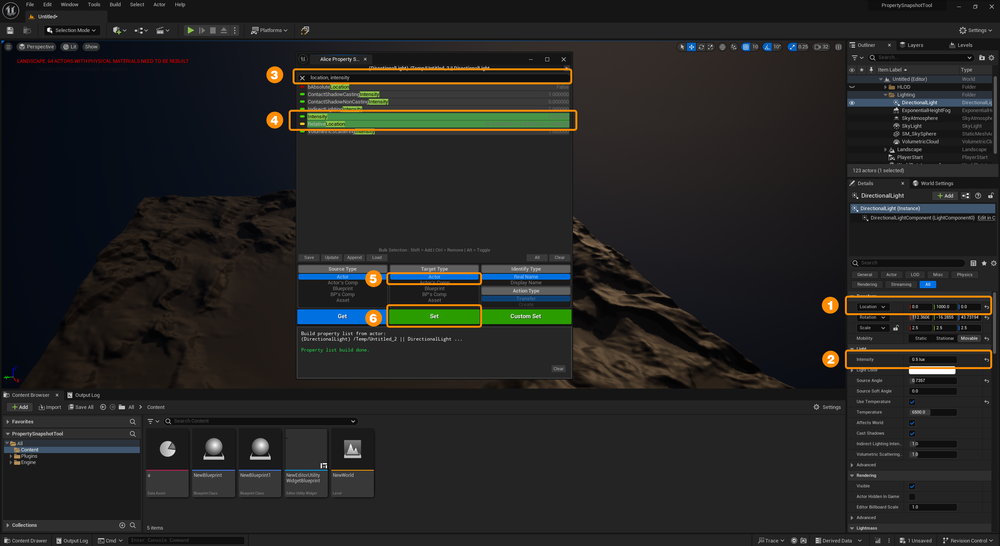

Now that we have temporarily stored the properties of the DirectionalLight, let's modify the ① **"RelativeLocation"** and ② **"Intensity"** property values of the DirectionalLight.

In the tool's main panel, ③ search for the keywords “Location” and “Intensity,” separated by a comma. ④ Find and select **RelativeLocation** and **Intensity**.

Set ⑤ **"Target Type"** to **"Actor"** to indicate that you want to transfer the snapshot values to the properties of the selected Actor.

Click the ⑥ **[Set]** button to start automatically transferring the properties.

Before starting the automatic transfer operation, a confirmation dialog will pop up, showing **Source Information** and **Target Object Information**.

You can select multiple transfer objects that meet the “Target Type” requirements at once and transfer properties to them.

Once you have confirmed that everything is correct, click **[Yes]** to proceed.

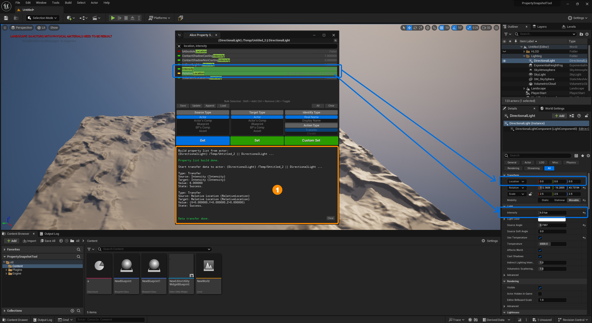

After executing the operation, the values recorded in the property snapshot will be transferred to the corresponding properties of the selected DirectionalLight.

You can view detailed operation information in the ① message window at the bottom of the tool panel.

You can undo most of the transfer operations by pressing **Ctrl+Z**.

# Interface & Operation Overview

## Main Panel

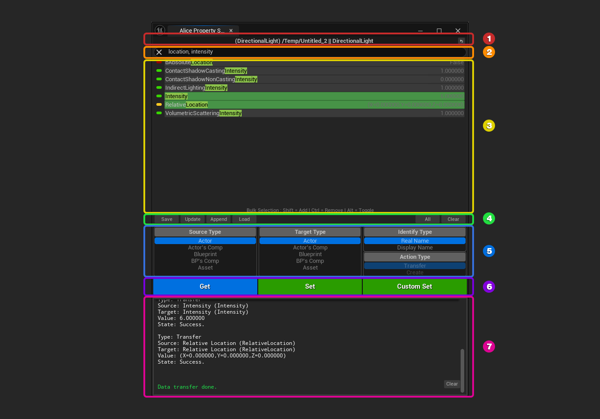

① Source Object Name / Restore Button
② Search Bar
③ Property Snapshot Item List
④ Property Snapshot File Edit Button (left) / Quick Select Button (right)
⑤ Settings Options
⑥ Main Button
⑦ Message Window

### Source Object Name / Restore Button

#### Source Object Name

After using the **[Get]** button to capture a property snapshot from the selected source object, the **Source Object Name** will be displayed at the top of the main panel.

There are 5 different Source Types, each allowing you to capture property snapshots from 5 different types of objects:

| Source Type           | Object Type Selection                                        |
| --------------------- | ------------------------------------------------------------ |
| Actor                 | Selected **Actor** from the scene                            |
| Actor's Component     | Selected **Component** from the Component List of a selected **Actor** in the scene |
| Blueprint             | Selected **Blueprint** from the Content Browser              |
| Blueprint's Component | Selected **Component** from the Component List in the **Blueprint** Editor |
| Asset                 | Other non-Blueprint **Asset** selected from the Content Browser |

The display names of the source objects for the 5 types are shown differently.

For example, when capturing a property snapshot from a selected DirectionalLight in the scene, the source object name will appear as follows:

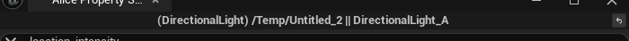

A DirectionalLight is an Actor, and its source object name corresponds to the information of this Actor as follows:

***(Object Type) Level Path || Object Name***

The 5 types of source objects will display their names as follows:

| Source Type           | Source Object Name Format                                  |
| --------------------- | ---------------------------------------------------------- |
| Actor                 | (Object Type) Level Path \|\| Object Name                  |
| Actor's Component     | (Object Type) Level Path \|\| Actor Name :: Component Name |
| Blueprint             | (Object Type) Object Path                                  |
| Blueprint's Component | (Object Type) Blueprint Path :: Component Name             |
| Asset                 | (Object Type) Object Path                                  |

#### Restore Button

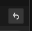

You can clear the currently recorded property snapshot by clicking the restore button next to the source object name.

### Search Bar

You can search for the corresponding property snapshot entries by entering keywords in the search bar.

The keywords need to be **longer than 2 characters**.

The tool allows searching with multiple keywords simultaneously; just separate them with **commas**. The tool will display all property snapshot entries that include the keywords.

### Property Snapshot Item List

When using the **[Get]** button to capture a property snapshot, the captured snapshot will be displayed as an entry in the item list. The property snapshot entries will be sorted by the display name of the properties.

#### Property Snapshot Details

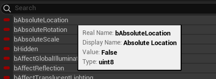

Hovering your mouse over a property snapshot entry will display the **details** of that property snapshot.

#### Select, Deselect, and Bulk Select Operations

| Operation           | Result                                                       |
| ------------------- | ------------------------------------------------------------ |
| Single Click        | Selects or deselects a single entry.                         |
| Click + Shift Click | Bulk selects all entries between the first click and the next Shift-click. |
| Click + Ctrl Click  | Bulk deselects all entries between the first click and the next Ctrl-click. |
| Click + Alt Click   | Bulk toggles selection for all entries between the first click and the next Alt-click. |

### Property Snapshot File Edit Button

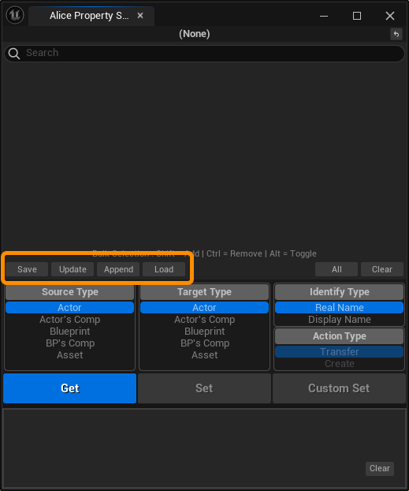

You can save the currently selected property snapshot entries in the list as permanent files and load them when needed. This is useful for temporarily storing certain parameters and reusing them later.

For specific instructions on how to use property snapshot files, refer to the **“Saving Snapshots as Files”** section of this document.

### Quick Select Button

You can use the **[All]** button to select all property snapshot entries in the list.

You can use the **[Clear]** button to deselect all selected property snapshot entries in the list.

### Settings Options

The settings options consist of four configurable menus, and adjusting them will directly affect the behavior of the property snapshot tool.

#### Source Type

**Source Type** determines from which type of single selected object the property snapshot will be captured when you click the [Get] button.

For specific details on capturing properties, refer to the **“Capturing Property Snapshots”** section of this document.

#### Target Type

**Target Type** determines which type of selected objects will receive the property snapshot when you click the [Set] or [Custom Set] button. You can select multiple target objects.

For specific details on transferring properties, refer to the **“Automatically Transferring Snapshots to Properties”** and **“Manually Transferring Snapshots to Properties”** sections of this document.

#### Identify Type

**Identify Type** specifies how the target properties are searched within the selected objects when you click the [Set] button.

For details on Identify Type, refer to the **“Automatically Transferring Snapshots to Properties: Identification Methods”** section of this document.

#### Action Type

**Action Type** is available when the "Target Type" is set to “Blueprint” and determines whether to transfer data to properties within the Blueprint or create new variables in the Blueprint when you click the [Set] button.

For specific details on Action Type, refer to the **“Details for Transferring to Blueprint Objects: Operation Methods”** section of this document.

### Main Button

The tool has 3 main buttons used for capturing property snapshots from source objects or transferring recorded snapshot values to target objects.

**Get -** Captures a property snapshot from the source object.

**Set -** Automatically transfers the snapshot to the properties of the target object.

**Custom Set -** Opens a configuration panel to manually set how the snapshot is transferred to the properties of the target object.

### Message Window

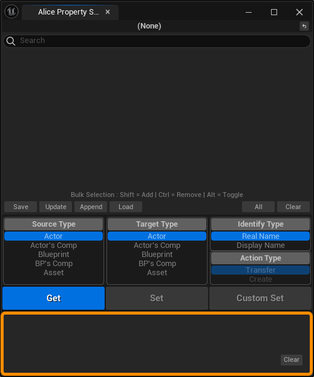

The Message Window displays feedback information for key operations.

## **Custom Configuration Panel**

① Target Object Information
② Settings Options
③ Property Snapshot Configuration List
④ Panel Buttons

The Custom Configuration Panel is a modal window that pops up when the user clicks the **[Custom Set]** button. It is used for manually configuring how the snapshot is transferred to properties.

For specific details on using the Custom Configuration Panel, refer to the **“Manually Transferring Snapshots to Properties”** section of this document.

# Capturing Property Snapshots

When you click the **[Get]** button, the tool will capture the property snapshot from the selected object(s) in the editor based on the specified **“Source Type”**.

If multiple objects of the specified type are selected in the editor, the tool will capture the property snapshot from the **last selected** object that meets the criteria.

When **“Source Type”** is **“BP's Comp”** (Blueprint's Component), the tool will capture the snapshot from the **last activated Blueprint editor window** containing the selected Component.

## Details on Capturing Property Snapshots

| Source Type           | Details                                                      |
| --------------------- | ------------------------------------------------------------ |
| Actor                 | Only properties that are **visible and editable on its details panel** can be captured. |
| Actor's Component     | Only properties that are **visible and editable on its details panel** can be captured. |
| Blueprint             | Only properties that are **visible and editable on its details panel** can be captured. |
| Blueprint's Component | Only properties that are **visible and editable in the CDO** (i.e., properties visible and editable in the Blueprint's instance details panel when placed in the level) can be captured. |
| Asset                 | Only properties that are **visible and editable in its editor details panel** can be captured. |

## Messages During Property Snapshot Capture

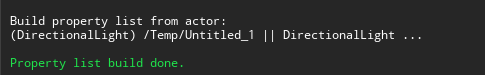

When the capture is successful, the Message Window will display messages similar to the ones above.

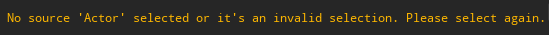

When the capture fails, the Message Window will display messages similar to the ones above.

# Automatically Transferring Snapshots to Properties

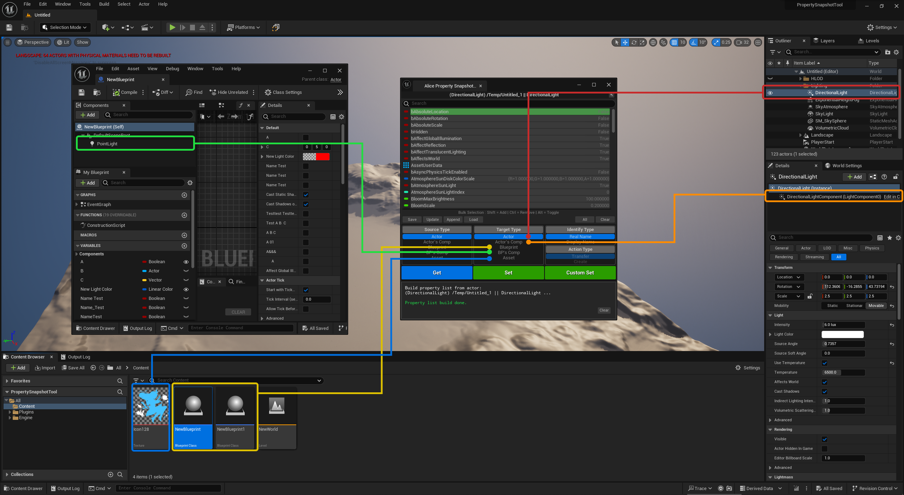

When the number of selected items in the property snapshot list is **greater than 1**, the **[Set]** button on the main panel will become active.

Clicking the **[Set]** button will automatically transfer the selected property snapshots from the list to the target objects currently selected in the editor, based on the **“Target Type”**. Multiple target objects can be selected, and the tool will sequentially transfer the properties to them.

The tool will use the **“Identify Type”** to determine how to search for matching properties by name in the selected objects. When a matching property is found and unambiguous, the tool will automatically transfer the property values stored in the snapshot to the target property.

## Details on Transferring Properties

| Target Type           | Details                                                      |
| --------------------- | ------------------------------------------------------------ |
| Actor                 | Data can only be transferred to **visible and editable properties** on its details panel. |
| Actor's Component     | Data can only be transferred to **visible and editable properties** on its details panel. |
| Blueprint             | Data can only be transferred to **visible and editable properties** in the **CDO** (i.e., properties visible and editable on the Blueprint instance details panel in the level). |
| Blueprint's Component | Data can only be transferred to **visible and editable properties** on its details panel. |
| Asset                 | Data can only be transferred to **visible and editable properties** on its editor details panel. |

## Identify Type

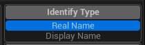

When automatically transferring snapshots to properties, there are two different criteria for identifying properties. This setting will affect how property snapshot item names are displayed and how the tool searches for target properties in the target objects during the transfer process.

| Identify Type | Details                                                      |
| ------------- | ------------------------------------------------------------ |
| Real Name     | 1- Displays the Real Name of the property in the property snapshot item name. 2- During automatic transfer, searches for properties with the same Real Name in the target objects, based on the Real Name stored in the source property snapshot. |
| Display Name  | 1- Displays the Display Name of the property in the property snapshot item name. 2- During automatic transfer, searches for properties with the same Display Name in the target objects, based on the Display Name stored in the source property snapshot. |

### Identify Type：Display Name

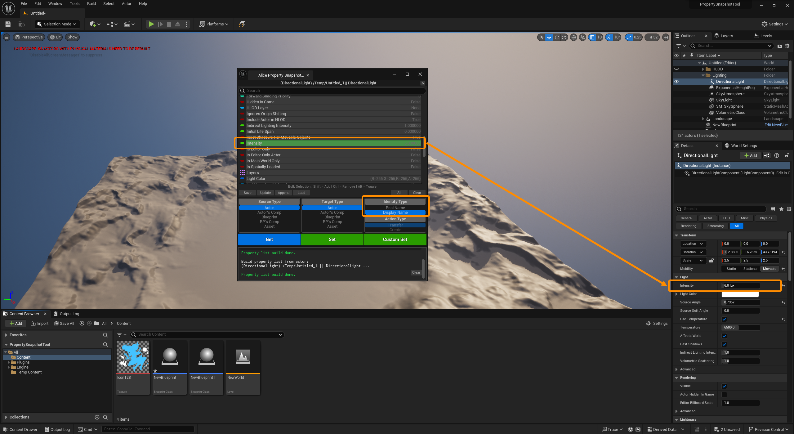

When **“Identify Type”** is set to **“Display Name”**, the tool will search for properties with the same Display Name in the target objects during automatic transfer, based on the Display Name stored in the source property snapshot.

Using “Display Name” to find target properties aligns more with the intuition of editor users. If you are a non-code user who only uses the engine editor, you typically only see the property’s “Display Name,” which is the name displayed on the details panel. With “Display Name” identification, you can clearly understand which properties with the same name the property snapshot will be transferred to on the target object.

### Identify Type：Real Name

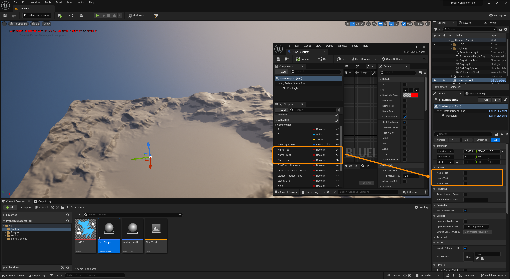

When **“Identify Type”** is set to **“Real Name”**, the tool will search for properties with the same Real Name in the target objects during automatic transfer, based on the Real Name stored in the source property snapshot.

As shown in the image above, different properties within the same object in the engine editor can have duplicate “Display Names.” In special cases, there may be multiple properties with the same “Display Name” within the same object. When this occurs, the tool cannot easily determine which property the property snapshot should be transferred to among the multiple properties with the same name, leading to target property conflicts. In such cases, the tool will skip the transfer of this property snapshot to the object and record the issue in the message window.

Retrieving properties by their “Real Name” helps resolve this issue because each property within the same object has a unique “Real Name” that cannot be duplicated. The tool can always find a unique corresponding property using this unique “Real Name.” However, for non-coding users who use the engine editor, property transfer based on “Real Name” cannot help you identify which property the property snapshot will be transferred to in the target object. This is because the “Display Name” and “Real Name” of each property can be inconsistent or completely different, and you can only see the “Display Name” in the editor interface, without knowing the “Real Name” information.

### Identify Type Suggestions

Typically, using **“Real Name”** is effective for property transfers between objects of the same type.

**“Display Name”** is suitable for transferring properties between different types of objects.

For more specialized cases, you can use the **[Custom Set]** button to manually transfer snapshots to properties, specifying the target property for each property snapshot project manually.

## Details for Transferring to Blueprint Objects

### Action Type

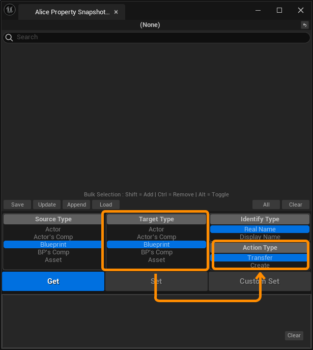

When the **"Target Type"** is set to **"Blueprint"**, the **"Action Type"** becomes **available**.

For **Blueprint** objects:

You can choose the **"Transfer"** action to transfer the property snapshot to existing properties. Alternatively, you can select the **"Create"** action to create a variable in the Blueprint with the same name as the property snapshot.

#### Action Type：Create

In **"Action Type: Create"** mode, the created variable name will change depending on the selected **"Identify Type"**:

| Identify Type | Details                                                      |
| ------------- | ------------------------------------------------------------ |
| Real Name     | The variable will be created with the **Real Name** of the property snapshot. |
| Display Name  | The variable will be created with the **Display Name** of the property snapshot. |

##### Force creating duplicate name variables

When there are already variables with the same name in the Blueprint, the tool will prompt you with a modal message box asking whether to automatically provide a new name for these duplicate variables to force the creation of new ones. The new name will have a suffix like "_Created_Number" added to the original variable name.

If you select **[Yes]** in the modal message box, new variables will be forcibly created with new names.

If you select **[No]** in the modal message box, the creation of duplicate variables will be skipped, and only non-duplicate variables will be created.

### Quick Start for Transferring to Blueprints Objects

① Create two blueprints, and ② create several new variables in one of them.

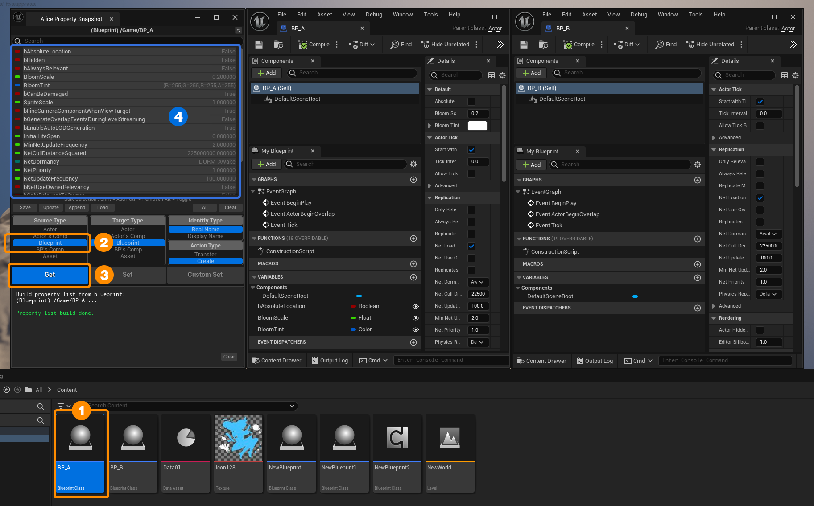

① Select the blueprint with new variables, open the tool panel, ② set **"Source Type"** to **"Blueprint"**, and ③ click the **[Get]** button to capture the blueprint's property snapshot.

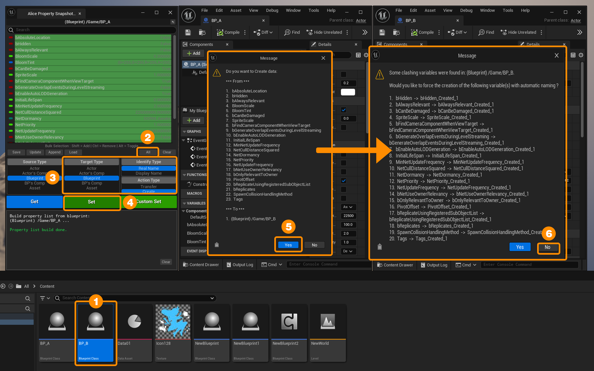

① Select the empty blueprint without new variables, ② click **[All]** in the tool panel to select all property snapshot entries.

③ Set **"Target Type"** to **"Blueprint"**. Now, the **"Action Type"** setting becomes available, and the tool will operate on the selected blueprint in the content browser.

③ Set **"Identify Type"** to **"Real Name"** so that new variables are created using the "Real Name" from the property snapshot.

③ Set **"Action Type"** to **"Create"** to indicate that we want to create new variables.

④ Click the **[Set]** button.

⑤ In the confirmation dialog, click **[Yes]** to start creating variables in the empty blueprint.

⑥ In the forced duplicate variable creation dialog, click **[No]** to skip the creation of duplicate variables.

Now, we have skipped variables that already existed in BP_B and created new variables that didn't exist in BP_B.

### Confirmation Dialogs

#### Action Confirmation Dialog

When you click **[Set]**, an **Action Confirmation Dialog** will pop up before starting to automatically transfer or create snapshots to properties. This dialog will indicate:

From which property snapshots (From) the properties will be transferred, and to which objects (To) they will be transferred.

#### Force Creation Confirmation Dialog

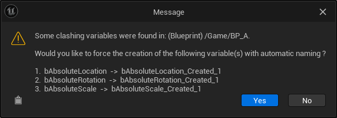

When the tool detects a name conflict during the process of creating snapshots in blueprints, a **Force Creation Confirmation Dialog** will appear. This dialog will confirm whether to continue force-creating variables with new names in cases of name conflicts. If multiple target objects have name conflicts, this dialog will pop up multiple times, asking about each conflicting target object.

The dialog will show how the conflicting name will be automatically changed to a new name, with the format:

**Old Conflicting Variable Name -> New Auto-Renamed Name**

# Manually Transferring Snapshots to Properties

When the number of selected property snapshot items from the list is **greater than 1**, the **[Custom Set]** button on the main panel will become active.

When you click the **[Custom Set]** button, the tool will prepare to transfer the selected property snapshots to the target objects specified by the **“Target Type”**. The selected target objects can be multiple, and the tool will transfer properties to them one by one.

When the tool is preparing to transfer property snapshots, a **Custom Configuration Panel** will pop up. When transferring properties to multiple target objects, the panel will display the total number of objects to be configured and the current object number being configured.

## Property Transfer Details

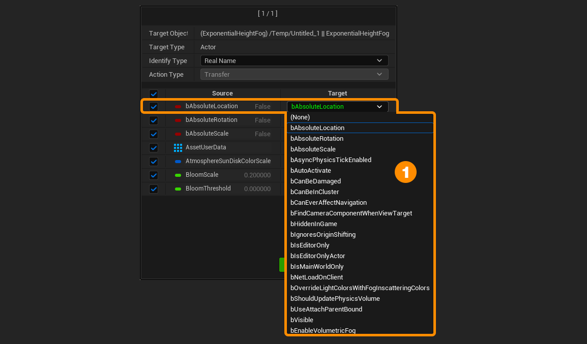

When the Custom Configuration Panel is generated, the tool will automatically search for properties with the same name in the target objects and set them as default options for the target properties. If no match is found, the target property will be left empty.

You can make the tool **skip** the transfer of a particular item by leaving the target property empty or unchecking the entry.

In the **Target** column's dropdown list, you will find the **modifiable properties of the same type** available in the current target object, from which you can select the target property.

You cannot configure different property snapshots to the same object property. When conflicts occur, the tool will display a **red error**, and the **[Set]** button will become **inactive**.

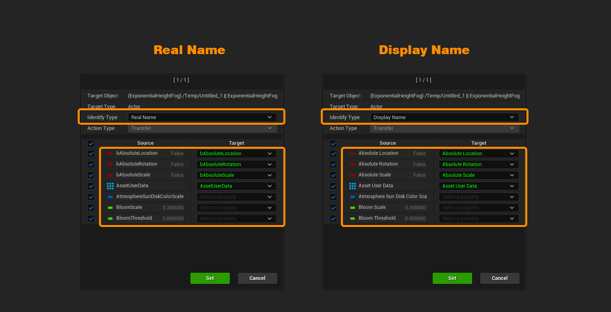

You can change the **“Identify Type”** to alter the display of property names. This setting **will not** affect the transfer results.

## Creating Property Details

① When **“Target Type”** is set to **“Blueprint”**, the **“Action Type”** setting in the Custom Configuration Panel becomes available. You can switch it to **“Create”** to enter the custom variable creation mode.

The tool will use the **“Real Name”** recorded in the property snapshot as the default new blueprint variable name. If a property with the same name already exists in the target object, the tool will display an **orange error**. At this point, the **[Set]** button will be **inactive**. You will need to manually enter a new variable name to resolve the naming conflict.

# Messages

## Execution Successful

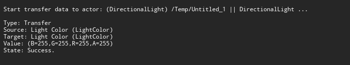

When the property snapshot transfer or creation is successful, the message window will display a message similar to the one above.

## Execution Failed

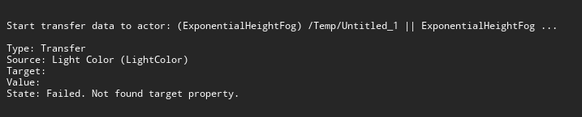

When the property snapshot transfer or creation fails, the message window will display a message similar to the one above.

### Failure Types

| Type                                            | Message                                                      | Description                                                  |
| ----------------------------------------------- | ------------------------------------------------------------ | ------------------------------------------------------------ |
| Transfer Failed, Target Property Not Found      | Type: Transfer ... State: Failed. Not found target property. | The tool could not find the corresponding property in the target object. |
| Transfer Failed, Target Property Conflict Found | Type: Transfer ... State: Failed. Found multiple conflicting target properties. | The tool found multiple conflicting properties in the target object. |
| Creation Failed, Source Property Not Found      | Type: Create ... State: Failed. Not found source property. | The tool could not find the source property or source class in the source object recorded by the property snapshot. |
| Creation Failed, Source Property Conflict Found | Type: Create ... State: Failed. Found multiple conflicting source properties. | The tool found multiple conflicting properties with the same name in the source object recorded by the property snapshot. |
| Creation Failed, Unsupported Property Type      | Type: Create ... State: Failed. Cannot create new variable from xxx type. | This type of property should not be created as a Blueprint variable. Please refer to the "Allowed Property Types" list below. |
| Creation Failed, Force Creation Cancelled       | Type: Create ... State: Failed. Cancel force create new variable. | The user cancelled the forced creation of a variable with a conflicting name. |

### Allowed Property Types

| Allowed Property Types: |        |        |
| ----------------------- | ------ | ------ |
| Soft Class              | Name   | Byte   |
| Soft Object             | String | Int    |
| Class                   | Text   | Int64  |
| Object                  | Bool   | TArray |
| Struct                  | Float  | TSet   |

## Execution Object Grouping

Property snapshot transfers or creations will be processed one object at a time. When you hover your mouse over the message window, the related message for each individual object will be highlighted.

# Saving Snapshots as Files

## Save and Load Snapshot Files

    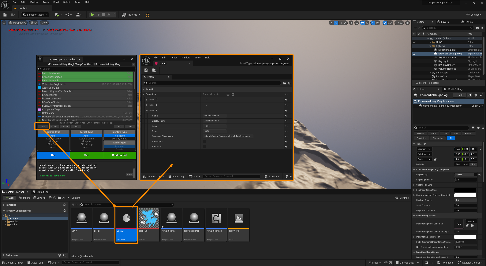
    

Click the **[Save]** button to save the selected property snapshots as a file. Later, you can click the **[Load]** button to load them as needed.

## Update Snapshot Files

Use the **[Update]** button to replace the content saved in the selected snapshot file with the currently selected property snapshots.

## Append Snapshots to File

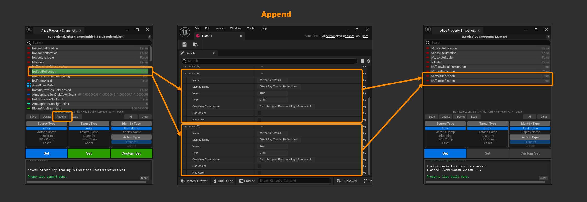

Use the **[Append]** button to add the currently selected property snapshots to the selected snapshot file.

After appending, the snapshot file can contain multiple snapshots with the same name, allowing you to save different versions of the same property multiple times.

