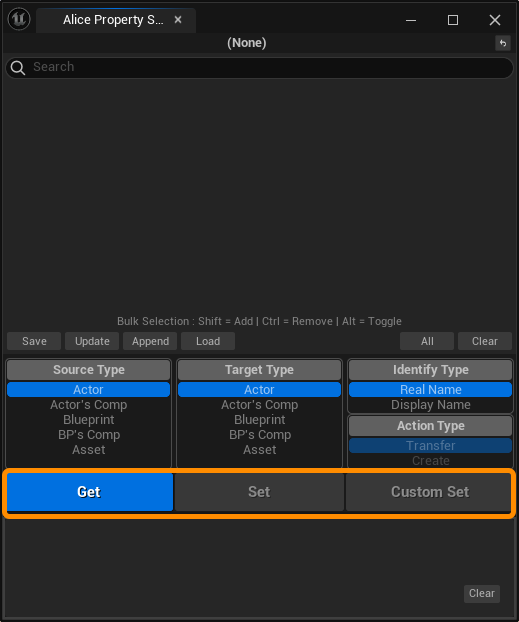

**Alice Property Snapshot Tool** 是一个用于在引擎编辑器中暂存和传递对象属性的便捷工具。

它能够读取并暂存引擎编辑器中大部分常用对象上的可编辑属性，并在需要时将其传递给其他对象上同名的或者用户指定的同类型属性。

# 快速入门

打开 ①Setting -> ②Plugins，搜索 ③“Alice Property Snapshot Tool”，④勾选后重启引擎编辑器，启用插件。

①点击 Toolbar 上的工具按钮，或者从 ②Window -> Alice Property Snapeshot Tool 菜单打开③工具面板。

如果您不希望 Toolbar 按钮被显示，可以通过工具设置关闭它。打开 ①Edit -> Editor Preferences，在 “Plugins” 分类下可以找到 ②“Alice Property Snapshot Tool” 插件设置，取消勾选 ③“Show on the Toolbar” 即可移除工具按钮。

您可以拖动工具面板，将其停靠在任意合适的位置。

选中场景中的任意 ①Actor，设置 ②**“Source Type”** 为 **“Actor”**，表明希望拾取的源类型为 Actor。点击 ③**[Get]** 按钮，获取选中 Actor 的细节面板属性。

现在我们已经暂存了 DirectionalLight 的属性，接下来我们将 DirectionalLight 的 ①“RelativeLocation” 和 ②“Intensity” 属性数值修改。

在工具主面板上③搜索关键字 “Location” 和 “Intensity”，关键字之间需要用逗号隔开。④找到并选中 RelativeLocation 和 Intensity。

设置 ⑤**“Target Type”** 为 **“Actor”**，表明希望将快属性快照记录的数值传递到选中 Actor 的属性上。

点击 ⑥**[Set]** 按钮，开始自动传递属性。

在正式开始执行自动传递操作前会弹出确认对话框，在对话框中将给出 **源信息** 和 **目标对象信息**。

您可以一次性选择多个符合 “Target Type” 要求的传递对象，同时向它们传递属性。

确认无误后，点击 **[Yes]** 继续操作。

执行操作后，属性快照中记录的数值将被传递到选中的 DirectionalLight 的对应属性。

您可以在工具面板下方的①消息窗口查看具体的操作信息。

您可以通过 **Ctrl+Z** ①撤销工具的大部分传递操作。

# 界面&操作介绍

## 主面板

① 源对象名称 / 还原按钮
② 搜索栏
③ 属性快照项目列表
④ 属性快照文件编辑按钮（左侧） / 快捷选择按钮（右侧）
⑤ 设置选项
⑥ 主按钮
⑦ 消息窗口

### 源对象名称 / 还原按钮

#### 源对象名称

当您使用 **[Get]** 按钮从选择的源对象获取属性快照后，在主面板的最上方将显示 **源对象名称**。

对应 5 种不同的 Source Type，可以从 5 种不同的对象获取属性快照：

| Source Type           | 选择对象类型                                                 |
| --------------------- | ------------------------------------------------------------ |
| Actor                 | 从场景中选中的 **Actor**                                     |
| Actor's Component     | 从场景中选中 **Actor** 的 Component List 中选中的 **Component** |
| Blueprint             | 从内容浏览器选中的 **Blueprint**                             |
| Blueprint's Component | 从 **Blueprint** 编辑器中的 Component List 选中的 **Component** |
| Asset                 | 从内容浏览器选中的非 Blueprint 的其他 **Asset**              |

5 种类型的源对象显示名称的方式不同。

例如，从场景中选中的 DirectionalLight 获取属性快照时，源对象名称看起来如下：

DirectionalLight 是一个 Actor，它的源对象名称对应了这个 Actor 的信息：

 ***(对象类型) 对象所在关卡路径 || 对象名称***

5 种源对象将分别以如下方式显示源对象名称：

| Source Type           | 源对象名称格式                                               |
| --------------------- | ------------------------------------------------------------ |
| Actor                 | (对象类型) 对象所在关卡路径 \|\| 对象名称                    |
| Actor's Component     | (对象类型) 对象所在关卡路径 \|\| 对象所在Actor名称 :: 对象名称 |
| Blueprint             | (对象类型) 对象路径                                          |
| Blueprint's Component | (对象类型) 对象所在Blueprint路径 :: 对象名称                 |
| Asset                 | (对象类型) 对象路径                                          |

#### 还原按钮

您可以通过点击源对象名称右侧的还原按钮，清空工具当前记录的属性快照。

### 搜索栏

您可以通过在搜索栏输入关键字的方式，搜索相应的属性快照条目。

在搜索时，关键字需要**大于 2 个字符**。

工具允许同时搜索多个关键字，您只需在关键字之间添加 **逗号** 将它们隔开。工具将显示所有包含关键字的属性快照条目。

### 属性快照项目列表

当使用 **[Get]** 按钮获取属性快照时，被获取的属性快照将作为属性快照条目显示在项目列表中。属性快照条目将按照属性的显示名称进行排序。

#### 属性快照详细信息

将鼠标悬停在属性快照条目上方，将显示该属性快照的**详细信息**。

#### 选择、取消选择 和 批量选择操作

| 操作                 | 结果                                                      |
| -------------------- | --------------------------------------------------------- |
| 单击                 | 选择 和 取消选择 单个条目。                               |
| 点选一次 + Shift点选 | 批量选择从第一次点选至下一次Shift点选条目之间的所有条目。 |
| 点选一次 + Ctrl点选  | 批量减选从第一次点选至下一次Ctrl点选条目之间的所有条目。  |
| 点选一次 + Alt点选   | 批量反选从第一次点选至下一次Alt点选条目之间的所有条目。   |

### 属性快照文件编辑按钮

您可以将当前在列表中选中的属性快照条目保存为永久的文件，并在需要时将其加载使用。这对需要暂存某些参数，并在稍后重新使用时很有用。

有关属性快照文件的具体使用方式，请参见本文档的 **“将快照保存为文件”** 章节部分。

### 快捷选择按钮

您可以通过 **[All]** 按钮全选属性快照条目列表中的所有属性快照条目。

您可以通过 **[Clear]** 按钮清空属性快照条目列表中选择的属性快照条目。

### 设置选项

设置选项由 4 个可供配置的选单构成，对它们进行设置将直接影响到属性快照工具的运行行为。

#### Source Type

Source Type 用于设置当您点击 [Get] 按钮时，从哪种单个选择对象获取属性快照。

有关获取属性的具体细节，请参见本文档的 **“获取属性快照”** 章节部分。

#### Target Type

Target Type 用于设置当您点击  [Set] 或 [Custom Set] 按钮时，向哪种选择对象传递属性快照，选择对象可以是复数个。

有关传递属性的具体细节，请参见本文档的 **“自动传递快照到属性” 和 “手动传递快照到属性”** 章节部分。

#### Identify Type

Identify Type 用于设置当您点击 [Set] 按钮时，以哪种方式在选择对象中搜索目标属性。

有 Identify Type 的具体细节，请参见本文档的 **“自动传递快照到属性：识别方式”** 章节部分。

#### Action Type

Action Type 在 "Target Type" 为 “Blueprint” 时可用，用于设置当您点击 [Set] 按钮时，向 Blueprint 中的属性传递数据，还是在 Blueprint 中创建新的变量。

有关 Action Type 的具体细节，请参见本文档的 **“传递到蓝图对象时的细节：操作方式”** 章节部分。

### 主按钮

工具有 3 个主按钮，用于从源对象获取属性快照、或将属性快照记录的值传递给目标对象。

**Get -** 从源对象获取属性快照。

**Set -** 自动传递快照到目标对象的属性。

**Custom Set -** 打开一个配置面板，手动设置传递快照到目标对象的属性。

### 消息窗口

消息窗口将显示关键操作的反馈信息。

## 自定义配置面板

① 目标对象信息
② 设置选项
③ 属性快照配置列表
④ 面板按钮

自定义配置面板是一个模态窗口，当用户点击 **[Custom Set]** 按钮时弹出，用于手动配置传递快照到属性。

有关使用自定义配置面板的具体细节，请参见本文档的 **“手动传递快照到属性”** 章节部分。

# 获取属性快照

当您点击 **[Get]** 按钮时，工具将根据 **“Source Type”** 指定的对象类型，从编辑器中正在被选择的对象获取该对象的属性快照。

当在编辑器中有多个指定类型的对象被选择时，将从选择集中挑选**最后一个**被选择的符合要求的对象。

当 **“Source Type”** 为 **“BP's Comp”**（Blueprint's Component）时，工具将从**最后一个被激活的蓝图编辑器窗口**中获取被选择的Component。

## 获取属性快照的细节

| Source Type           | 细节说明                                                     |
| --------------------- | ------------------------------------------------------------ |
| Actor                 | 总是只能从其**细节面板上可见且可编辑的属性**获取属性快照。   |
| Actor's Component     | 总是只能从其**细节面板上可见且可编辑的属性**获取属性快照。   |
| Blueprint             | 总是只能从其**细节面板上可见且可编辑的属性**获取属性快照。   |
| Blueprint's Component | 总是只能从其 **CDO 中的可见且可编辑 的属性**（即当蓝图在关卡中实例细节面板上可见且可编辑的属性）获取属性快照。 |
| Asset                 | 总是只能从其**编辑器细节面板上可见且可编辑的属性**获取属性快照。 |

## 获取属性快照时消息

当获取成功时，消息窗口将提示如上类似的消息。

当获取失败时，消息窗口将提示如上类似的消息。

# 自动传递快照到属性

当用户从属性快照项目列表中选取的项目数量**多于 1 个**时，主面板上的 **[Set]** 按钮将亮起变为可操作状态。

当您点击 **[Set]** 按钮时，工具将根据 **“Target Type”** 指定的对象类型，向编辑器中正在被选择的目标对象自动传递列表中被选择的属性快照。选择的目标对象可以有多个，工具将依次向它们进行属性传递。

工具将根据 **“Identify Type”** 指定的识别方式，在选中的对象中以名称搜索的方式查找可能存在的同类型属性，在属性存在且无歧义时自动传递属性快照中储存的属性值到目标属性。

## 传递属性的细节

| Target Type           | 细节说明                                                     |
| --------------------- | ------------------------------------------------------------ |
| Actor                 | 总是只能对其**细节面板上可见且可编辑的属性**进行数据传递。   |
| Actor's Component     | 总是只能对其**细节面板上可见且可编辑的属性**进行数据传递。   |
| Blueprint             | 总是只能对其 **CDO 中的可见且可编辑 的属性**（即当蓝图在关卡中实例细节面板上可见且可编辑的属性）进行数据传递。 |
| Blueprint's Component | 总是只能对其**细节面板上可见且可编辑的属性**进行数据传递。   |
| Asset                 | 总是只能对其**编辑器细节面板上可见且可编辑的属性**进行数据传递。 |

## 识别方式（Identify Type）

在自动传递快照到属性时，有 2 种不同的识别属性的依据。这个设置将影响属性快照项目名称的显示方式，以及工具在进行自动传递快照到属性时如何在目标对象中查找目标属性。

| Identify Type | 细节说明                                                     |
| ------------- | ------------------------------------------------------------ |
| Real Name     | 1- 将属性的 Real Name 显示到属性快照项目名称。 2- 在自动传递时从目标对象中通过属性快照储存的源属性的 Real Name 查找具有相同 Real Name 的属性。 |
| Display Name  | 1- 将属性的 Display Name 显示到属性快照项目名称。 2- 在自动传递时从目标对象中通过属性快照储存的源属性的 Display Name 查找具有相同 Display Name 的属性。 |

### Identify Type：Display Name

将 **“Identify Type”** 设置为 **“Display Name”** 时，工具将在自动传递时，会在目标对象中通过属性快照储存源属性的 Display Name 查找具有相同 Display Name 的属性。

以 “Display Name” 的方式查找目标属性更加符合编辑器使用者的直觉，如果您是只使用引擎编辑器的非代码用户，那么您通常只能够看到属性的 “Display Name”：即属性显示在细节面板上的名称。在通过 “Display Name” 识别属性的方式下，您可以切实地知晓属性快照将被传递给目标对象上的哪个同名属性。

### Identify Type：Real Name

将 **“Identify Type”** 设置为 **“Real Name”** 时，工具将在自动传递时从目标对象中通过属性快照储存的源属性的 Real Name 查找具有相同 Real Name 的属性。

如上图所示。在引擎编辑器同一个对象中不同属性的 “Display Name” 允许重复，特殊的情况下，同一个对象中可能存在多个具有相同 “Display Name” 的属性。当出现这种情况时，工具无法简单地决定需要将属性快照传递给对象里多个属性中的哪一个，从而遇到目标属性冲突的问题。此时，工具将跳过这个属性快照项目在该对象中的传递，并在消息窗口中记录相关问题。

检索属性的 “Real Name” 有助于解决这个问题，因为同对象中每个属性的 “Real Name” 不允许重复。工具总是可以通过唯一的 “Real Name” 找到唯一与其对应的属性。对于使用引擎编辑器的非代码用户而言，以 “Real Name” 为前提的属性传递无法帮助您知道属性快照将被传递给目标对象中的哪个属性，因为每个属性的 “Display Name” 与 “Real Name” 可以是不一致或是完全不同的，您只能在编辑器界面中看到属性的 “Display Name”，无法知晓其 “Real Name” 信息。

### Identify Type 建议

通常，**“Real Name”** 方式能够帮助您很好地完成同类型对象间的属性传递。

**“Display Name”** 适用于在大多数非同类型对象间进行属性传递。

一些更加特殊的情况，您可以通过使用 **[Custom Set]** 按钮进行手动传递快照到属性的操作，为每一个属性快照项目手动指定要传递到的属性目标。

## 传递到蓝图对象时的细节

### 操作方式（Action Type）

当 **“Target Type" **为 **“Blueprint”** 时，**“Action Type”** 将变为**可用**状态。

对于 **Blueprint** 对象：

您可以选择 **“Transfer”** 操作将属性快照传递至已有的属性。或者您可以选择 **“Create”** 操作在蓝图中创建与属性快照同名的变量。

#### Action Type：Create

在 **“Action Type：Create”** 方式下，创建的变量名将跟随选择的 **“Identify Type”** 不同而发生变化：

| Identify Type | 细节说明                                         |
| ------------- | ------------------------------------------------ |
| Real Name     | 将以属性快照的 **Real Name** 为新名称创建变量    |
| Display Name  | 将以属性快照的 **Display Name** 为新名称创建变量 |

##### 强制创建重名变量

当 Blueprint 中已有重名变量时，工具将以①模态消息框的形式询问一次是否为这些重名的变量自动提供一个新名字，以强制创建新变量。新名字将在变量的原有名称后添加一个类似 “_Created_Number” 的后缀。

当您在模态消息框弹出后选择 **[Yes]** 后，将以新的变量名强制创建新变量。

当您在模态消息框弹出后选择 **[No]** 后，则跳过强制创建重名变量，只创建非重名变量。

## 传递到蓝图对象快速入门

①创建两个蓝图，②在其中一个蓝图里创建若干新变量。

①选择创建了新变量的蓝图，打开工具面板，②将 **“Source Type”** 设定为 **“Blueprint”**，③点击 **[Get]** 按钮，④获取蓝图的属性快照。

①选择没有创建过新变量的空蓝图，②点击工具面板上的 **[All]** 按钮，选择所有属性快照条目。

③将 **“Target Type”** 设定为 **“Blueprint”**，此时 “Action Type” 设置将变为可用，工具将对在内容浏览器中选中的 Blueprint 进行操作。

③将 **“Identify Type”** 设定为 **“Real Name”**，我们将以属性快照中记录的 “Real Name” 为名称在蓝图中创建新变量。

③将 **“Action Type”** 设定为 **“Create”**，表明我们希望进行新变量的创建操作。

④点击 **[Set]** 按钮。

⑤在弹出的创建确认对话框中选择 **[Yes]** 按钮，开始在空蓝图中创建变量。

⑥在弹出的强制创建重名变量对话框中选择 **[No]** 按钮，跳过重名变量的创建。

现在，我们跳过了在 BP_B 中原本存在的变量，将原本在 BP_B 中不存在的新变量创建到了 BP_B 中。

## 确认对话框

### 操作确认对话框

当您点击 **[Set]**，开始自动传递或创建快照到属性之前，将弹出**操作确认对话框**。该对话框会提示：

将从**（From）**哪些属性快照，传递属性到**（To）**哪些对象中。

### 强制创建确认对话框

当工具在执行创建快照到蓝图的过程中检测到重名属性冲突时，将弹出**强制创建确认对话框**。该对话框将向您确认是否继续以新名称强制创建发生重名的变量。如果有多个目标对象中具有重名属性冲突，该对话框将弹出多次，每次问询一个正在发生冲突的目标对象。

对话框会提示如何将已重名的名称自动更改为新名称，提示的格式如下：

**旧冲突变量名 -> 新自动重命名**

# 手动传递快照到属性

当用户从属性快照项目列表中选取的项目数量**多于 1 个**时，主面板上的 **[Custom Set]** 按钮将亮起变为可操作状态。

当您点击 **[Custom Set]** 按钮时，工具将根据 **“Target Type”** 指定的对象类型，向编辑器中正在被选择的目标对象预备传递列表中被选择的属性快照。选择的目标对象可以有多个，工具将依次向它们进行属性传递。

当工具①预备传递属性快照时，会弹出②**自定义配置面板**。当需要向多个目标对象传递属性时，③面板上方将显示将要配置对象的总数，和当前正在配置几号对象。

## 传递属性细节

当自定义配置面板生成时，工具会自动在目标对象中搜索同名属性，并将其作为目标属性的默认选项。如果没有找到则会将目标属性置空。

您可以通过将目标属性置空或者取消条目勾选的方式令工具**跳过**该条目的传递。

在 Target 栏的①下拉列表中，将罗列出当前目标对象中允许被修改的**同类型属性**，您可以从中选择目标属性。

您无法将不同的属性快照配置给同一个对象属性。当发生冲突时，工具将提示**红色错误**，此时 **[Set]** 按钮将变为**不可用**。

您可以改变 **“Identify Type”** 来改变属性名称的显示方式。该设置**不会**影响传递的结果。

## 创建属性细节

①当 **“Target Type”** 为 **“Blueprint”** 时，自定义配置面板中的 **“Action Type”** 设置变为可用，您可以将其切换为 **“Create”** 进入自定义创建变量的配置模式。

工具将以属性快照记录的 **“Real Name”** 作为默认新的蓝图变量名称，如果目标对象中已经存在同名属性，工具将以②**橙色错误**提示，此时 **[Set]** 按钮将**不可用**。您需要手动输入一个新变量名以解决重名问题。

# 消息

## 执行成功

当属性快照传递或创建成功时，消息窗口将提示如上类似的消息。

## 执行失败

当属性快照传递或创建失败时，消息窗口将提示如上类似的消息。

### 失败类型

| 类型                           | 消息                                                         | 说明                                                         |
| ------------------------------ | ------------------------------------------------------------ | ------------------------------------------------------------ |
| 传递失败，未找到目标属性       | Type: Transfer ... State: Failed. Not found target property. | 工具没有从目标对象中找到对应的属性。                         |
| 传递失败，发现目标属性冲突     | Type: Transfer ... State: Failed. Found multiple conflicting target properties. | 工具从目标对象中找到多个冲突的对应属性。                     |
| 创建失败，未找到源属性         | Type: Create ... State: Failed. Not found source property. | 工具没有从属性快照记录的源对象中找到属性快照记录的源Class或者源属性。 |
| 创建失败，发现源属性冲突       | Type: Create ... State: Failed. Found multiple conflicting source properties. | 工具从属性快照记录的源对象中找到多个冲突的同名属性。         |
| 创建失败，不支持创建的属性类型 | Type: Create ... State: Failed. Cannot create new variable from xxx type. | 该类型属性不应作为蓝图变量被创建。请参考下方 “允许创建属性列表”。 |
| 创建失败，取消强制创建         | Type: Create ... State: Failed. Cancel force create new variable. | 用户取消了强制创建重名变量。                                 |

### 允许创建属性列表

| 允许创建属性类型： |        |        |
| ------------------ | ------ | ------ |
| Soft Class         | Name   | Byte   |
| Soft Object        | String | Int    |
| Class              | Text   | Int64  |
| Object             | Bool   | TArray |
| Struct             | Float  | TSet   |

## 执行对象分组

属性快照传递或创建将逐对象进行，当您将鼠标移至消息窗口中时，将高亮单个对象的相关消息。

# 将快照保存为文件

## 保存和加载快照文件

    
    

点击 **[Save]** 按钮，您可以将选择的属性快照保存为文件，并在稍后需要时点击 **[Load]** 按钮加载它们。

## 更新快照文件

通过 **[Update]** 按钮，可以用当前选中的属性快照替换选中的快照文件中保存的内容。

## 将属性快照追加到文件

通过 **[Append]** 按钮，可以将当前选中的属性快照添加到选中的快照文件中。

Append 操作后的快照文件允许多个同名的属性快照存在，因此您可以多次保存同一个属性的不同版本。

